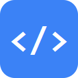
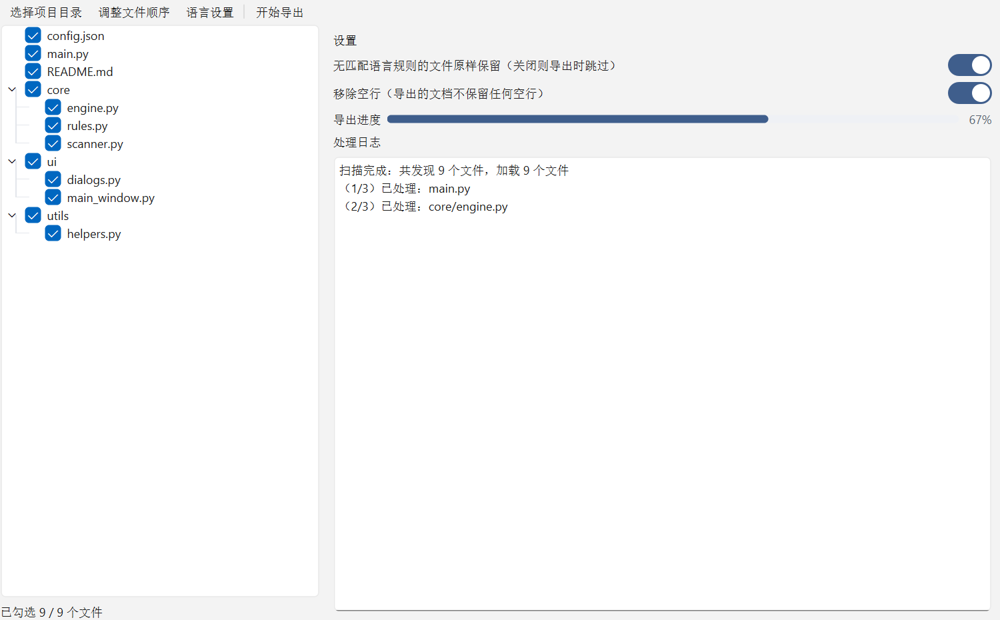
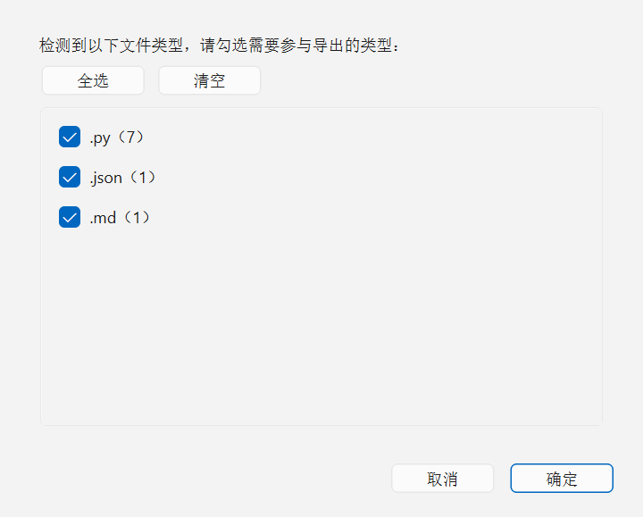
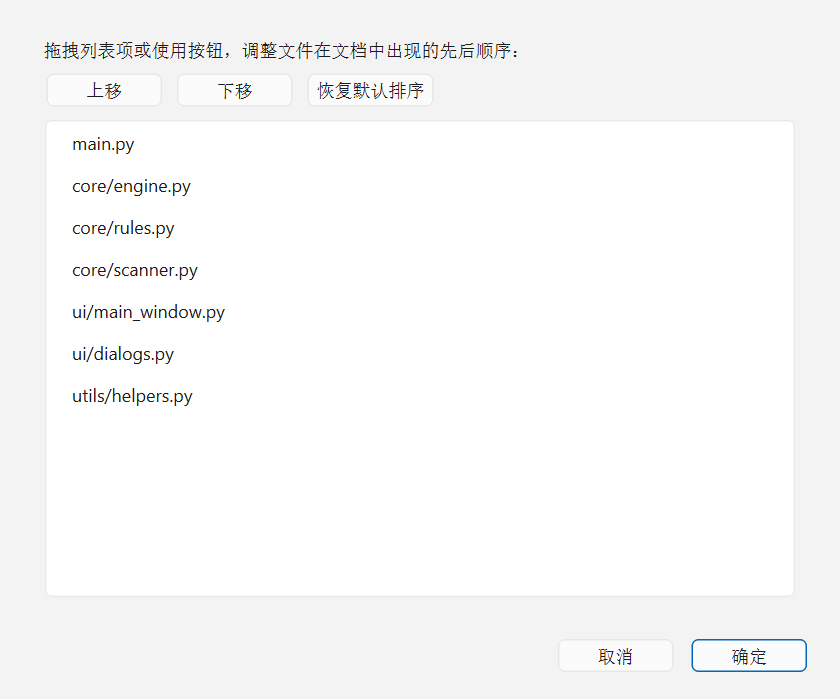
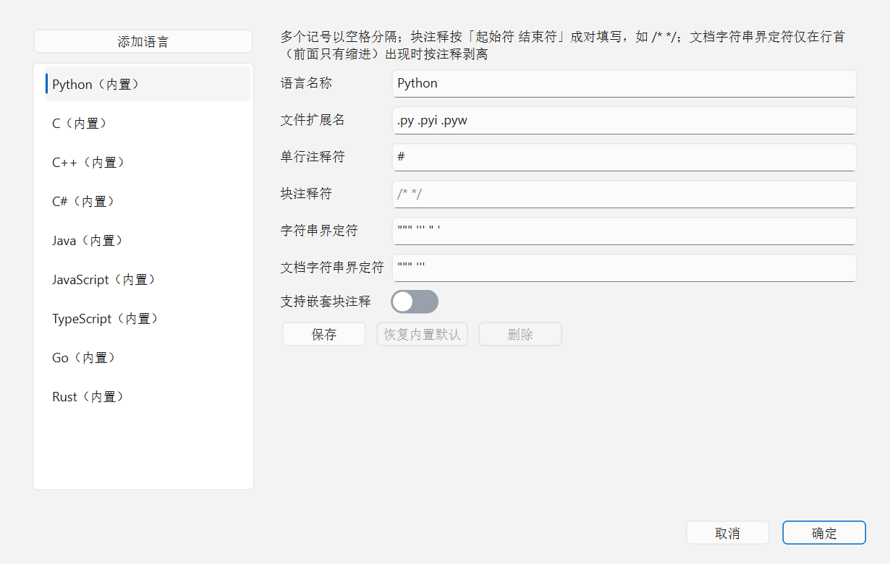

<div align="center">
  
  <h1>PureCode</h1>
  <p><strong>去除注释 · 编排顺序 · 一键导出软著代码文档</strong></p>
  <p>
    
    
    
  </p>
  <p>中文 | <a href="README_EN.md">English</a></p>
</div>

## 简介

申请**计算机软件著作权**时，版权局要求提交一份包含源代码的 Word 文档——其中的代码应当**去除所有注释**，仅保留代码本体。而当材料交由第三方代理机构提交时，我们往往**无法决定哪些代码文件排在前面、哪些排在后面**。

**PureCode** 是为 [InstructionX](https://github.com/KKPIP-Tech/InstructionX) 框架开发的插件，正是为解决这两个痛点而生：

1. **去除注释**：基于可扩展的语言规则引擎，精准剥离行注释、块注释与文档字符串（如 Python 的 `"""` docstring），**全程不修改原文件**；
2. **编排顺序**：通过拖拽自由调整文件在导出文档中的先后顺序，把核心代码排在最前。

最终一键导出一份以项目命名的 `{项目名称}_code.docx` 文档，直接可用于软著申请材料。

## 功能特性



- **项目目录扫描**：选择项目目录后自动递归扫描全部文件，按目录层级以 Tree 组件展示；
- **文件类型粗选**：扫描完成后自动识别目录下出现的所有文件格式，以复选框形式供快速筛选；
- **文件树精选**：在 Tree 中逐文件/逐目录勾选，精确决定哪些文件写入导出文档；
- **去注释引擎**：内置 9 种语言规则（Python、C、C++、C#、Java、JavaScript、TypeScript、Go、Rust），字符串字面量感知，不会误删字符串中的 `//`、`#` 等内容；
- **文件顺序编排**：拖拽或按钮调整文件顺序，自定义顺序优先于默认路径排序；
- **导出进度反馈**：进度条实时反映「逐文件处理 → 写文档」两阶段进度，处理日志同步滚动；
- **中英双语界面**：跟随框架语言实时切换；
- **跨插件 / MCP API**：对外暴露 `export_code_document` 服务接口，支持无 UI 调用。

### 文件类型粗选

扫描完成后弹出文件类型对话框，按扩展名归类统计，支持全选 / 清空：



### 文件顺序编排



### 语言设置（可扩展规则）

语言设置窗口左右两列：左侧为语言列表与「添加语言」按钮，右侧为选中语言的注释规则与文件格式设定。内置规则可另存为自定义副本，也可以从零创建全新语言：



## 安装

PureCode 仓库是标准的 InstructionX 单插件仓库（根目录含 `IXRepo.json`），通过框架内置的 GitHub 一键安装器安装：

1. 打开 InstructionX，进入「插件管理」对话框；
2. 选择「从 GitHub 安装」，粘贴仓库地址：

   ```
   https://github.com/Ender-William/PureCode.git
   ```

3. 确认安装。插件声明的 `python-docx (>=1.1.0)` 依赖会由框架自动安装，无需手动处理。

## 使用方法

1. **选择项目目录**：点击工具栏「选择项目目录」，选中待导出的项目根目录；
2. **粗选文件类型**：在弹出的文件类型对话框中勾选需要参与导出的扩展名；
3. **精选文件**：在左侧文件树中逐项勾选最终要写入文档的文件；
4. **调整顺序（可选）**：点击「调整文件顺序」，拖拽排定文件在文档中的先后；在右侧设置区可按需开关「移除空行」「无规则文件原样保留」；
5. **开始导出**：点击「开始导出」，确认保存路径（默认文件名 `{项目名称}_code.docx`），等待进度条走完即可。

## 自定义语言规则

语言设置中添加 / 编辑的规则以 JSON 结构持久化，字段含义如下：

| 字段 | 类型 | 说明 |
|------|------|------|
| `name` | string | 语言名称（必填，唯一） |
| `extensions` | string[] | 关联的文件扩展名（必填，自动规范为小写带前导点） |
| `line_comments` | string[] | 单行注释符，如 `//`、`#`（与块注释至少配置一项） |
| `block_comments` | [string, string][] | 块注释起止对，如 `["/*", "*/"]` |
| `string_delimiters` | string[] | 字符串界定符，如 `"`、`'`（保护字符串内容不被误删） |
| `docstrings` | string[] | 文档字符串界定符，如 `"""`（行首启发式剥离） |
| `escape_char` | string | 字符串转义符，默认 `\` |
| `nested_block` | bool | 块注释是否支持嵌套（如 Rust），默认 `false` |

自定义规则存储于插件私有数据区（DataProvider），随框架数据持久化，重装插件不丢失。

## 导出文档说明

- **文件名**：默认 `{项目名称}_code.docx`（项目名称为所选目录名）；
- **版式**：A4 页面，项目名作为文档标题；
- **文件块**：每个文件以其相对路径为小标题，正文为去注释后的代码，西文使用 Consolas 等宽字体；
- **源文件安全**：所有去注释处理均在内存中完成，**不会写回或修改任何源文件**。

## 已知边界

- Python docstring 采用**行首启发式**剥离（`"""`/`'''` 出现在行首、前面仅有缩进时视为文档注释）；代价是行首裸表达式形式的三引号字符串会被一并剥离（词法上无法与 docstring 区分），赋值/参数位置的多行字符串不受影响；
- 文件自定义顺序仅存于内存，重新选择目录后重置；
- 不内置软著模板的页数/行数自动裁剪（如「前 60 页」），文档内容为用户勾选文件的全量代码。

## 对外 API

插件通过 `service_api` 对外暴露服务（自动注册为跨插件 API 并同步为 MCP 工具）：

```python
export_code_document(
    project_dir: str,                 # 项目目录
    output_path: str,                 # 输出 docx 路径
    extensions: list[str] | None,     # 限定扩展名，None 表示全部
    remove_blank_lines: bool = False, # 是否移除空行
) -> dict  # {output_path, file_count, skipped, unmatched}
```

## 开发与测试

- 分支约定：`dev` 为纯开发分支，pytest 测试代码仅存在于 `test` 分支；
- 在框架仓库根目录执行测试（需先切换到含测试代码的分支）：

  ```powershell
  .venv\Scripts\python.exe -m pytest custom_plugin/test/ -q
  ```

- 需求与设计文档见 `pure-code/docs/req/2026-09-07/`（PRD / SPEC）。

## 许可证

本项目基于 [GNU AGPL v3](LICENSE) 开源。

**作者**：William_Kuang
