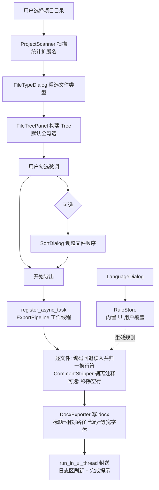
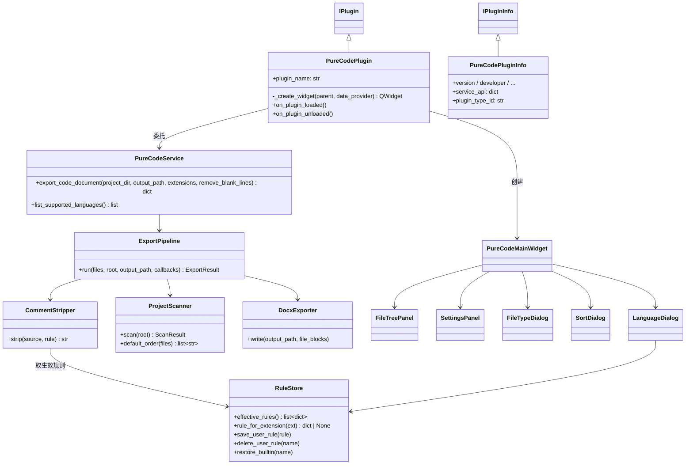
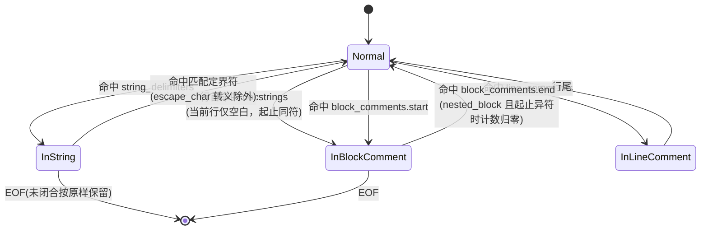
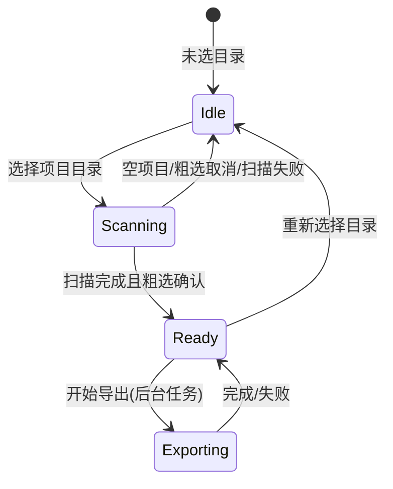

# SPEC — PureCode 插件技术规格文档

- **创建日期**：2026-09-07
- **修改日期**：2026-09-07

## 1. 技术方案与设计决策（Why）

### D1 去注释引擎：规则驱动的通用状态机

- **决策**：不针对具体语言编写解析器，而是实现一个由 `LanguageRule` 数据完全驱动的单遍扫描状态机。
- **Why**：软著去注释不需要完整的语法分析，只需要可靠地区分「代码 / 字符串字面量 / 注释」三种词法语境。字符串界定符（防误删字符串内的注释符）、单行/块注释符均可数据化，新增语言 = 新增一条规则数据，满足开闭原则与用户自定义扩展需求（PRD F9）。
- **已知取舍**：不处理条件编译、嵌套字符串插值（如 f-string 内嵌引号）等深层语法；docstring 与多行字符串字面量词法不可区分，采用行首启发式（见 D8）。

### D2 语言规则双层存储：内置只读 + 用户覆盖

- **决策**：内置规则存放于插件 `config/default_rules.json`（随插件发布、只读）；用户新增/修改的规则经 DataProvider PRIVATE 命名空间持久化（键 `language_rule_overrides`）；生效规则按 `name` 合并、用户优先。
- **Why**：`config/` 是规范要求的插件配置目录，适合发布态只读默认值；用户数据必须走 DataProvider（插件目录随卸载删除，不能写用户数据）。「覆盖式合并」让内置规则可被用户修正且可一键恢复默认。
- **注册时机**：框架不在插件加载期代办 DataProvider 注册——RuleStore 在首次读写前自行 `get_plugin_info` 检查并 `register_plugin`（重复注册抛错需容忍：框架 API 注册实例与插件 UI 实例先后初始化同一插件 ID）。

### D3 排序与勾选分离

- **决策**：Tree 只负责层级展示与勾选（F4/F5）；文件顺序由独立的排序对话框调整（F7），产出相对路径有序列表。
- **Why**：用户明确指定——Tree 用于结构化展示与选择，顺序调整用单独窗口；拖拽 Tree 节点会同时破坏层级语义与勾选三态，交互冲突大。
- **v1 取舍**：自定义顺序仅存内存（主 Widget 持有），重选目录即重置。

### D4 导出任务：框架后台任务系统 + UI 线程封送

- **决策**：导出流水线经 `services.task_manager.register_async_task` 提交线程池；回调与日志更新一律 `utils.thread_utils.run_in_ui_thread` 封送回 UI 线程；`task_manager` 为 None 时降级为同步执行并记 WARNING。
- **Why**：框架统一生命周期管理（托盘可见、优雅关闭）；后台任务回调在工作线程执行，直接碰 Qt 控件会导致 UI 崩溃。

### D5 导出格式：python-docx 适配器

- **决策**：`document_exporter.py` 以适配器模式封装 python-docx，对上暴露「写文件块（相对路径标题 + 代码段列表）」的纯粹接口。
- **Why**：隔离第三方库接口变化；未来扩展 PDF/TXT 导出只需新增适配器。依赖经 `IXPlugin.json` 声明，由框架 DependencyManager 自动安装。

### D6 UI 组装：UIKit 组件 + Qt 原生补齐

- **决策**：文件树用 UIKit `Tree(checkable=True)`（Qt 自动三态联动）；Toolbar 用 Qt 原生 `QToolBar`+`QAction`（全局 QSS 已覆盖，UIKit 无 Toolbar 组件）；日志区用原生 `QPlainTextEdit` 只读；弹窗用 UIKit `Dialog` / `Message`，不用 QMessageBox；文件/目录对话框用原生 `QFileDialog`。
- **Why**：框架全局 QSS 自动覆盖上述原生控件，插件零成本跟随主题；规范要求插件不自建主题、不用 QMessageBox。

### D7 编码回退链与换行符归一

- **决策**：文件按字节读入，依次尝试 `utf-8 → gb18030` 解码，全部失败则记 WARNING 日志并跳过该文件；解码成功后统一将 `\r\n` / `\r` 归一为 `\n`。
- **Why**：Windows 中文项目常见 GBK 系编码；回退链覆盖绝大多数场景且不引入 chardet 等新依赖；单文件失败不应中断整体导出。换行符归一是因为无规则文件走「原样保留」路径不经过引擎的行尾空白清理，残留的 `\r` 会被 python-docx 转换为 `<w:br/>`，导致 Word 中每行多余断行。

### D8 docstring 行首启发式

- **决策**：规则新增可选字段 `docstrings`（界定符列表）。界定符在**当前行已扫描部分为纯空白**（行首/仅缩进）时按块注释剥离（起止同符）；同一界定符仍保留在 `string_delimiters` 中，赋值/参数等位置出现时按字符串原样保留。起止同符的块注释禁止嵌套计数，否则起始符会被误计为嵌套导致无法闭合。
- **Why**：docstring 与多行字符串字面量词法不可区分，行首启发式覆盖模块/类/函数 docstring 的普遍写法；规则字段化保持「新增语言零改引擎」的可扩展性（PRD F9），内置 Python 规则默认启用。
- **代价**：行首裸表达式形式的三引号字符串会被误剥离（罕见写法，PRD §7 已注明）。

## 2. 目录结构与模块划分

```
custom_plugin/
├── IXRepo.json                     # 仓库索引（plugins 仅列 pure-code）
└── pure-code/
    ├── IXPlugin.json               # 插件描述文件（dependencies: python-docx>=1.1.0）
    ├── __init__.py
    ├── entrance.py                 # PureCodePlugin(IPlugin)：胶水层，协调 UI 与 Service
    ├── information.py              # PureCodePluginInfo(IPluginInfo)：元数据 + service_api
    ├── service.py                  # PureCodeService：对外 API 门面 + 导出编排
    ├── config/
    │   └── default_rules.json      # 内置语言规则（只读发布）
    ├── text/
    │   ├── zh.xml                  # 默认语言（全键覆盖）
    │   └── en.xml
    ├── icons/
    │   └── icon.png                # 技能图标
    ├── function/                   # 业务逻辑层（禁止 PySide6）
    │   ├── models.py               # LanguageRule 数据模型与校验（纯 dict，JSON 可序列化）
    │   ├── rule_store.py           # RuleStore：内置加载 + 用户覆盖合并 + DataProvider 持久化
    │   ├── rule_text_codec.py      # 规则文本编解码：表单「空格分隔」文本 ↔ 规则列表字段
    │   ├── comment_stripper.py     # CommentStripper：规则驱动去注释状态机
    │   ├── project_scanner.py      # ProjectScanner：目录扫描、扩展名统计、默认排序、树模型
    │   ├── document_exporter.py    # DocxExporter：python-docx 适配器
    │   └── export_pipeline.py      # ExportPipeline：收集→剥离→排版→写盘编排
    ├── ui/                         # 视图层（禁止业务逻辑）
    │   ├── main_widget.py          # PureCodeMainWidget：QToolBar + QSplitter 骨架与动作编排
    │   ├── file_tree_panel.py      # FileTreePanel：Tree 构建、勾选收集、选中统计
    │   ├── settings_panel.py       # SettingsPanel：设置区（保留无规则文件/移除空行开关）+ 日志区
    │   ├── file_type_dialog.py     # FileTypeDialog：扩展名粗选（复选框 + 计数）
    │   ├── sort_dialog.py          # SortDialog：顺序拖拽调整 + 上移/下移/恢复默认
    │   └── language_dialog.py      # LanguageDialog：左列添加按钮+语言列表，右列规则表单
    └── docs/
        └── req/2026-09-07/         # 本文档与 PRD
```

## 3. 数据流向



## 4. 类与接口关系



## 5. 状态机设计

### 5.1 去注释引擎状态机（单遍字符扫描）



- 匹配优先级：在同一位置同时可能命中多个记号时，按**行首文档字符串 → 字符串定界符 → 单行注释符 → 块注释符**顺序匹配；同类多记号（如 `"""` 与 `"`）按**最长匹配优先**，该优先级表由规则数据预编译生成，属引擎内部常量策略。
- 行语义：剥离后整行为空且原行含注释 → 删除整行；行尾注释 → 剥离后去除尾部空白；字符串内容一律原样保留；原始空行在引擎层保留，「移除空行」由导出流水线按开关在拼装文档前统一执行（默认开启）。

### 5.2 主界面状态机



- 文件类型粗选、排序、语言设置对话框均为**模态对话框**，不作为独立状态；排序与导出仅 Ready 态可用，导出还要求勾选非空。
- 实现方式：状态枚举 `_UiState` + 转换表 `_ACTION_STATES` 驱动工具栏动作可用性，禁止堆砌 boolean 标志（见 `ui/main_widget.py`）。

## 6. 语言规则数据模型

`LanguageRule`（纯 dict，JSON 可序列化）：

| 字段 | 类型 | 说明 |
|------|------|------|
| `name` | str | 语言名（合并主键，唯一） |
| `extensions` | list[str] | 扩展名（含点，小写，如 `".py"`） |
| `line_comments` | list[str] | 单行注释符，如 `["#"]`、`["//"]` |
| `block_comments` | list[list[str]] | 块注释起止对，如 `[["/*", "*/"]]` |
| `string_delimiters` | list[str] | 字符串界定符，如 `["\"", "'", "\"\"\""]` |
| `docstrings` | list[str] | 文档字符串界定符（可选，默认 `[]`）；行首出现时按块注释剥离，见 D8 |
| `escape_char` | str | 字符串转义符，默认 `"\\"` |
| `nested_block` | bool | 块注释是否可嵌套（Rust），默认 false |
| `builtin` | bool | 是否内置（运行时标注，不入库） |

生效规则 = 内置 ∪ 用户覆盖（按 `name` 合并，用户优先）。扩展名 → 规则的索引在规则变更时重建。

## 7. 涉及修改的描述文件与配置项

| 文件 | 内容 |
|------|------|
| `custom_plugin/IXRepo.json` | 新建：`plugins` 数组仅含 `{ "path": "pure-code", "id": "pure-code", "name": "PureCode" }` |
| `custom_plugin/pure-code/IXPlugin.json` | 新建：`id=pure-code`、`version=alpha.0.1.0`、`main=entrance.py`、`dependencies={"python-docx": ">=1.1.0"}`、name/description 多语言字典 |
| `custom_plugin/pure-code/config/default_rules.json` | 内置规则：Python / C / C++ / C# / Java / JavaScript / TypeScript / Go / Rust |
| DataProvider 键（PRIVATE） | `language_rule_overrides`（用户规则覆盖列表） |

## 8. 对外 API（service_api）

- `export_code_document(project_dir: str, output_path: str, extensions: list[str] | None = None, remove_blank_lines: bool = False) -> dict`：无 UI 导出（供跨插件 / MCP 调用），返回 `{output_path, file_count, skipped, unmatched}`；
- `list_supported_languages() -> list[dict]`：返回当前生效的语言规则清单（含 `docstrings` 字段）。

Service 类名 `PureCodeService`，构造函数候选签名 `(plugin_id, data_provider)`。

## 9. 测试策略（测试代码仅提交至插件仓库 test 分支）

- `comment_stripper`：各内置语言正常路径；边界（字符串内含注释符、转义符、未闭合字符串/块注释、嵌套块注释、空文件、整行注释、行尾注释）；docstring 行首启发式（模块/函数 docstring 剥离、赋值与 return 位置保留、起止同符禁止嵌套计数）。
- `rule_store`：合并优先级、覆盖/恢复默认、非法规则校验、DataProvider 读写。
- `project_scanner`：默认字母序（深度优先、每层名称排序）、类型过滤、空目录、符号链接/不可读目录容错。
- `export_pipeline`：临时目录端到端生成 docx 并回读校验；移除空行开关；CRLF/CR 换行符归一（含无规则文件原样保留路径）。
